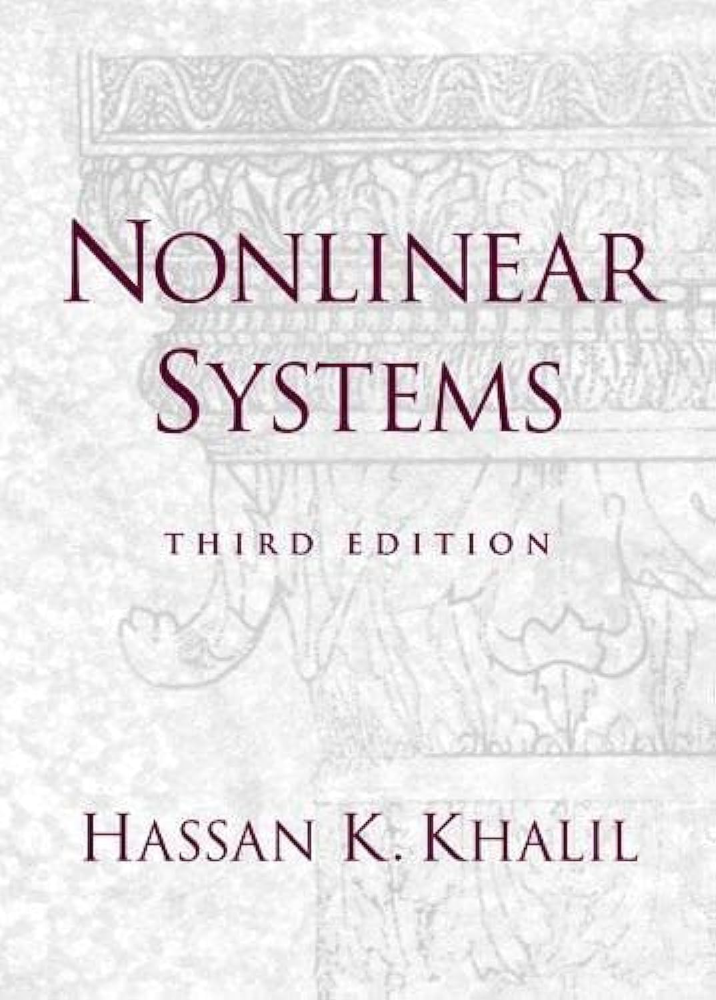

## Syllabus

you can download the course syllabus [here](Programme-SNL.pdf).

## Videos

### Nonlinear Systems Course Videos









### Homework Solutions Videos












## Course notes
you can download the course notes [here](Cours-snl-2025.pdf) in PDF format or [here](Cours-snl-2025.ps) in PostScript format.

## Recommanded books
Here are some recommended textbooks.
**Title   :** Nonlinear systems, 3rd edition
**Author  :** Hassan Khalil
**Editor  :** Prentice Hall


<!-- **Bilibili**:

    

**Video file**

Videos may be added to a page by either placing them in your `assets/media/` media library or in your [page's folder](https://gohugo.io/content-management/page-bundles/), and then embedding them with the _video_ shortcode:

    

## Podcast

You can add a podcast or music to a page by placing the MP3 file in the page's folder or the media library folder and then embedding the audio on your page with the _audio_ shortcode:

    

Try it out:



## Test students

Provide a simple yet fun self-assessment by revealing the solutions to challenges with the `spoiler` shortcode:

```markdown

You found me!

```

renders as

 You found me 🎉 

## Math

Hugo Blox Builder supports a Markdown extension for $\LaTeX$ math. You can enable this feature by toggling the `math` option in your `config/_default/params.yaml` file.

To render _inline_ or _block_ math, wrap your LaTeX math with `$...$` or `$$...$$`, respectively.

{}
We wrap the LaTeX math in the Hugo Blox _math_ shortcode to prevent Hugo rendering our math as Markdown.
{}

Example **math block**:

```latex

$$
\gamma_{n} = \frac{ \left | \left (\mathbf x_{n} - \mathbf x_{n-1} \right )^T \left [\nabla F (\mathbf x_{n}) - \nabla F (\mathbf x_{n-1}) \right ] \right |}{\left \|\nabla F(\mathbf{x}_{n}) - \nabla F(\mathbf{x}_{n-1}) \right \|^2}
$$

```

renders as


$$\gamma_{n} = \frac{ \left | \left (\mathbf x_{n} - \mathbf x_{n-1} \right )^T \left [\nabla F (\mathbf x_{n}) - \nabla F (\mathbf x_{n-1}) \right ] \right |}{\left \|\nabla F(\mathbf{x}_{n}) - \nabla F(\mathbf{x}_{n-1}) \right \|^2}$$


Example **inline math** `$\nabla F(\mathbf{x}_{n})$` renders as $\nabla F(\mathbf{x}_{n})$.

Example **multi-line math** using the math linebreak (`\\`):

```latex

$$f(k;p_{0}^{*}) = \begin{cases}p_{0}^{*} & \text{if }k=1, \\
1-p_{0}^{*} & \text{if }k=0.\end{cases}$$

```

renders as



$$
f(k;p_{0}^{*}) = \begin{cases}p_{0}^{*} & \text{if }k=1, \\
1-p_{0}^{*} & \text{if }k=0.\end{cases}
$$



## Code

Hugo Blox Builder utilises Hugo's Markdown extension for highlighting code syntax. The code theme can be selected in the `config/_default/params.yaml` file.


    ```python
    import pandas as pd
    data = pd.read_csv("data.csv")
    data.head()
    ```

renders as

```python
import pandas as pd
data = pd.read_csv("data.csv")
data.head()
```

## Inline Images

```go
 Python
```

renders as

 Python

## Did you find this page helpful? Consider sharing it 🙌 -->
